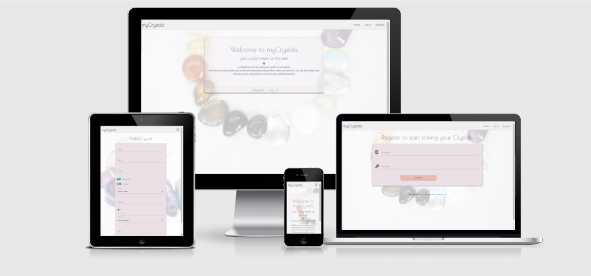
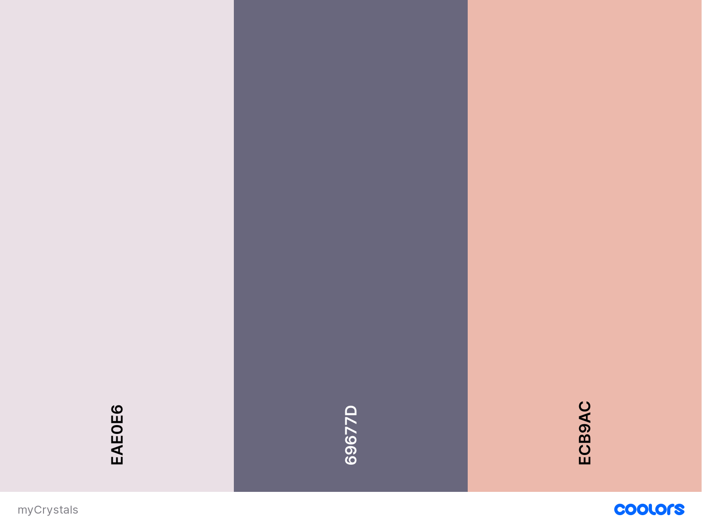
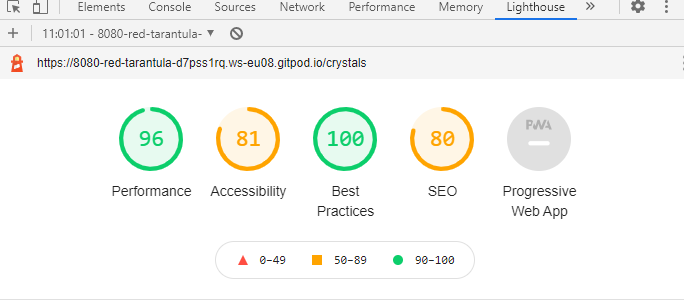
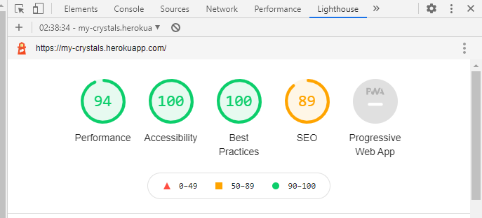
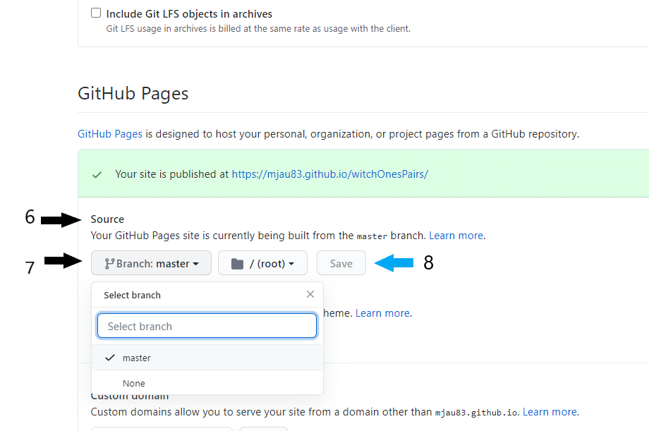

# myCrystals
### your crystal helper on the web

## Project Goals
**What is it?** 
A simple way to store information about your crystals so that you can access the information when you need it.

**Who is it for?**
This is for any healer, witch, yogi or anyone that likes spriritual stuff and might use crystals in their daily life, 
in rituals, meditaion or other practices. 

**Why am I building it?**
Almost everytime when I'm going to use a crystal for a specific purpose I need to check my crystal box to see what 
I have, and if I can't remember what it's used for I also need to turn to Google to find out the specific properties.
After asking around in different spriritually themed communities it turned out that I wasn't alone. I hope that this 
site can help us get a little bit more organized.

## Table of Content

* [**UX**](#ux)
    * [User Goals](#user-goals)
    * [User Stories](#user-stories)
    * [Site Owner Goals](#site-owner-goals)
    * [Design](#design) 
* [**Wireframes**](#wireframes)
* [**Database Structure**](#database-structure)
* [**Features**](#features)
* [**Technologies Used**](#technologies-used)
    * [Languages](#languages)
    * [Frameworks Libraries Programs](#frameworks-libraries-programs)
* [**Testing**](#testing)
    * [Bugs](#bugs)
    * [To Do](#to-do)
* [**Deployment**](#deployment)
    * [GitHub Pages](#gitHub-pages)
* [**Credits**](#credits)

## UX

### User Goals
* The site should work on all devices
* The User should be able to register a Username
* The site should have a clear dashboard that is easy to navigate
* The User should be able to add multiple crystals
* The User shoud be able to check if a crystal is waterproof and/or sunproof
* The User should be able to add information like name, color, properties etc about each crystal

### User Stories

* As a user I want to, be able to register a uniqe Username and a Password
* As a user I want to, be able to Login and Logout
* As a user I want to, add/create as many crystals as I want to
* As a user I want to, add information about each crystal
* As a user I want to, be able to search for specific properties 
* As a user I want to, be able to edit/update my information
* As a user I want to, be able to delete a crystal 
* As a user I want to, be able to journal when a crystal last was used

### Site Owner Goals
* To have a site that is attractive to the spiritual community
* Have good functionallity for the User

### Design

#### Fonts:

I used fonts from [Google Fonts](https://fonts.google.com/)
* [Poiret One](https://fonts.google.com/specimen/Poiret+One?query=Poiret+On) was used for the headings
* [Open Sanse](https://fonts.google.com/specimen/Open+Sans?query=Open+Sans) was used for the text

#### Images:

All images are my own and is taken by me using eihter my Sony Xperia or my Canon EOS450D. All images are also edited by me using Gimp.

#### Color: 

I wanted to have soft and light colors to match the background

[Back to top](#table-of-content)

## Wireframes
Balsamiq was used to create the wireframes for this project. I originally 
wanted to have a link in the navbar to the journal section. But after thinking about
it for a couple of times I realized that much easier for the user to get a overview 
of the information for each crystal if the journal and the crystal information is in
one place.

* Desktop Wireframes
    * [Index](wireframes/index-dskt.png)
    * [Home](wireframes/home-dskt.png)
    * [Journal](wireframes/journal-dskt.png )
    * [Add New Crystal](wireframes/add-new-crystal-dskt.png)
    * [Add New Journal](wireframes/add-journal-dskt.png)
    
* Tablet Wireframes
    * [Index](wireframes/index-tab.png)
    * [Home](wireframes/home-tab.png)
    * [Journal](wireframes/journal-tab.png)
    * [Add New Crystal](wireframes/add-new-crystal-tab.png)
    * [Add New Journal](wireframes/add-journal-tab.png)

* Smartphone Wireframes 
    * [Index](wireframes/index-sp.png)
    * [Home](wireframes/home-sp.png)
    * [Journal](wireframes/journal-sp.png)
    * [Add New Crystal](wireframes/add-new-crystal-sp.png)
    * [Add New Journal](wireframes/add-journal-sp.png)

[Back to top](#table-of-content)

## Database Structure

To set up the database I used MongoDB for this project.
I added the following collections:

### Crystals:
**_id:** | **ObjectId**
------------ | -------------
crystal_name | String
color | String
usage | String
is_waterproof | String
is_sunproof | String
name_of_chakra | String
quantity | String
date_used | String
name_of_method | String
notes | String
crystal_owner | String

### Chakras:
**_id:** | **ObjectId**
------------ | -------------
name_of_chakra | String

### Usage_method:
**_id:** | **ObjectId**
------------ | -------------
name_of_method | String

### Users:
**_id:** | **ObjectId**
------------ | -------------
username | String
password | String

[Back to top](#table-of-content)

## Features
* Responsive on different devices
* Login and Logout functionallity
* Search crystals by usage, chakra or usage method (such as mediation, ritual etc)
* CRUD:
    * Create - Possability to add new crystals and to journal the usage
    * Read - Possability to view the added information about each crystal and to see when and how it was last used
    * Update - Possability to update the information and the journal for each crystal 
    * Delete - Possability to delete a crystal 

[Back to top](#table-of-content)

## Technologies Used
### Languages
* [HTML5](https://en.wikipedia.org/wiki/HTML5)
* [CSS3](https://en.wikipedia.org/wiki/CSS)
* [JavaScript](https://en.wikipedia.org/wiki/JavaScript)
* [Python](https://en.wikipedia.org/wiki/Python_(programming_language))

### Frameworks and Libraries 
* [Google Fonts](https://fonts.google.com/) was used to import the fonts mentioned above 
in the project
* [Coolors](https://coolors.co/) was used to decide on th colors and to create the color 
palette
* [Am I Responsive](http://ami.responsivedesign.is/) was used to make the mockup
* [Materialize](https://materializecss.com/) was used to make the site responsive and for adding components

### Tools
* [Balsamic](https://balsamiq.com) was used to create wireframes in the beginning of 
the project
* [WebAIM](https://webaim.org/resources/contrastchecker/) was used to check that the contrast is ok
* [Gimp](https://www.gimp.org/) was used to edit photos.
* [Favicon.cc](https://www.favicon.cc/) was used to create the fave icon
* [Webformatter](https://webformatter.com/html) was used to beautify the code
* [Gitpod](https://gitpod.io/) was used for coding the project
* [Github](https://github.com/) was used to save and stored on the project after being 
pushed from Gitpod. Github was also use to deploy the site

[Back to top](#table-of-content)

## Testing

The was tested for Android on Samsung A50 and Xperia 10. It was also tested on laptop
and desktop view (PC).

The code was tested with:
* [W3C Markup Validator](https://validator.w3.org/)
* [W3C CSS Validator](https://jigsaw.w3.org/css-validator/)
* [JSHint](https://jshint.com/)

**Lighthouse**

* Test 1

* Test 2

## User Stories
**As a user I want to, be able to register a uniqe Username and a Password**

* Plan

I want to create a form that the user can use for registration to add a uniqe username. If no other
user have the same username the user can register a password that the user like.

* Implementation

I created a form for the user to fill in when they click on "Register". Here the user can choose a username
and a password. If the username already exsists a flash message will be displayed to the user that the
"Username already exists", and the user will be redirected to a empty registration form to try again.
If the username dosn't exist in the db the new user will be inserted to the db and the user gets logged in
to start add crystals to the userprofile.

* Test

I tried to add three different users to see that the registration form worked properly. At sometime I tried
to add a username that already was in the db, and that showed me the flash message telling me to try again.

* Result

The new user is registered to the db only if the username doesn't exsist in the db already, and a new user
can't register a username that already exsist

* Verdict 

The registration form works as planned.

**As a user I want to, be able to Login and Logout**

* Plan

I the user already is registered I want them to be able to log in using the password they choose at
the point of registration. I also want them to be able to log out from the session when they like to.

* Implementation

When the user enters the website they can choose to log in if they have registered befor. The form checks to 
see if the username is in the db, and if it, is it check so that the username matches. If it's a match the
user gets logged in and can view all the crystals they have added. If the user doesn't exist in the db, or
if the username doesn't match, and the user will be redirected to a empty log in form to try again. When the
user wishes to log out they can click on the "Log Out" link in the navbar and that will end the session and 
take them back to the log in form.

* Test

I have tried to log in with a password that doesn't match the registered user, and I have tried to log in 
with a username that doesn't exists in the db. Both shows the flash message telle me "The Username and/or 
Password is incorrect. Please try again". I have also tried logging out using both the log out link in the
navbar and the link in the mobile sidenav, and both are redirecting me to the log in form again so that I
can log in again if I like.

* Result

A unregistered user can't log in, neither can a registered user that uses the wrong password. Both gets a
message to try again. When the user want to log out they are redirected to the log in page after logging out.

* Verdict 

Both log in and log out function works as planned

**As a user I want to, add/create as many crystals as I want to**

* Plan

I wanted to create a form for the user so they can add their crystals and store them in the db

* Implementation

I created a form for the user to add crystals to their userprofile and didn't set any limit to it.

* Test
I tried adding a number of different crystals to different users.

* Result

Crystals are added to the db.

* Verdict 

The Add Crystal form works as planned 

**As a user I want to, add information about each crystal**

* Plan

I wanted the user to bale to add information about each crystal using a form.
The form should hold information about such things as name, color, usage proper and chakras. But I also
wanted the user to be able keep a little bit of track of how and when they use their crystals, if they liked. 

* Implementation

I created a form for the user to add crystals to their userprofile. In the form they can add name, color,
usage, mark if the crystal is waterproof and/or sunproof, choose the chakras represented by that
crystal, add number of crystals they own, pick a date when it was last used, choose what it was
used for and add a note. When the user clicks on the "Add Crystal" button a flash message will tell
the user "You Just Added A Crystal!", and the new crystal will be inserted to the db. If the user 
don't want to add a crystal at that time theycan click on the "Cancel" button and go back to where 
all the crystals are viewed. 

* Test

I clicked on the Add Crystal link in the navbar/sidenav and it takes me to the Add Crystal form to
start adding all my informtion. I can pick from the options in the chakras and methods dropdown menus
and I can also use the date picker to choose a specific date. When I click "Add Crystal" the flash message
is shown at the top telling that the crystal been added, and when I click "Cancel" I come back to the
userprofile to the that the new crystal been added with all the information in the accordion. I can
also see if I marked a crystal as waterproof/sunproof in the header of the accordion since a icon
is displayed for the one thats been marked.

* Result

Crystals are added to the db with all the information and is also shown to the user so they can get
a good overlook of all the crystals, and also access the information about each stone easily.

* Verdict 

The Add Crystal form works as planned 

**As a user I want to, be able to search for specific properties**

* Plan

I wanted the user to be able to search through all the crystals they have added if they wanted to find a
crystal to use for a specific purpose.

* Implementation

I created a search bar at the top of the page so that it's easy to access it as soon as the user loggs in.
The search bar is connected to a index in MongoDB and it was created in the terminal. It allows the user to
serach for crystal name, usage and method.

* Test 

I log in to the site and the search bar is displayed att the top on all devices. If I search for "grounding"
Garnet commes up as I have added it yo the db with the usage property of grounding. This also works if I do a
search for "Meditaion" or search for a name of a crystal.
After testing it a couple of times I realize that searching for the name might not be as useful. It might be
better to be able to do a search for a specific chakra instead, so the user can find a crystalfor a specific
chakra in a easy way. I droped the index in MongoDB and created a new one targeting Usage, Chakra and method
instead.

* Result

When the user loggs in to the website the search bar is accessed at the top of the page, and the user can
search for a preaviously saved usage purpose, method or chakra. The result is displayed to the user as a
accordion that can be clicked to show all the information.

* Verdict 

The search function works as planned and shows the results for the user.

**As a user I want to, be able to edit/update my information**

* Plan

I want the user to be able to edit the information they have added about each crystal, so they can update
the number of crystals they have, change the date when it last was used and what it was used for.

* Implementation

I created form that looked the same as the Add Crystal form and using ObjectId it gets the already added 
information about a specific crystal and shows it to the user. The form is access through the "Edit" button
for each crystal, so the user knows which crystal that is being edited. The user can then change any 
information in the form and update it to the db. When the update is done a flash message is displayed saying
"Your Crystal Is Updated!", and the new information is showed in the accordion for that crystal when the user
click on "Cancel" or "Crystals" in the navbar. 

* Test

I tried edit the information about the crystals, such as changing the date, changing chakra, changing method,
quantity etc. All feilds in the form updates to the db and shows the new information to the user. If I check
the box for waterproof that wasn't checked befor the drop icon appers in the accordion header.

* Result

The new information is updated to the db and shown to the user when they click on the accordion.

* Verdict 

The edit form works as planned

**As a user I want to, be able to delete a crystal**

* Plan

The user should be able to delete a crystal if they no longer use it of have it. But it shouldn't be to easy to 
delete a crystal and I want to check wth the user that they are sure that they want to delete it.

* Implementation

In the accordion next to the "Edit" button I created a "Delete" button so that the user knows which crystal 
that's being deleted. But to be sure the user knows that the removal is permanent I added a modal asking the
user if they are sure that they want to remove the crystal from the db. They can then choose to Cancel the 
process or to continue and Delete the crystal.

* Test

To test this I added some crystals to a userprofile, and then used the "Delete" button to remove them. everytime
I clicked the Delete button the modal popped up asking "Do you really want to delete {{ crystal.crystal_name }}?"
When I clicked Cancel I got redirected to the userprofile and the crystal was still visable. When I cicked 
Delete the crystal was removed and no longer visable in the userprofile or in the db.

* Result

The modal shows up to ensure that the user want to proceed deleting the crystal, and when they do it is removed
from the userprofile and db. The user can also cancel the process and then the crystal is left where it was.

* Verdict 

The "Delete" button and modal work as planned

**As a user I want to, be able to journal when a crystal last was used**

* Plan

I wanted the user to be able to track how and when they are using their crystals. They should be able to
pick a date and also choose which method they are using. I also want them to have the possability to a some
notes if they like.

* Implementation

In the Add Crystal form I have added a datepicker so that the user pick a date for when they last used their
crystal. They can also choose how they used it by picking ne of the options in the dropdown. They can choose 
from meditaion, healing, ritual, tarot or other. I also added a textarea so the user can add a short description
so they easily can track their usage.

* Test

When I tried adding crystals used the datepicker to select the date, it also prevents the user form adding a date
manually by them self. I can choos a method from the dropdown, and if I choose "Other" I can use the textarea
specific what I did or the feeling I had. When added allthis shows up in the accordion for that specific crystal.

* Result

The user can keep a simple journal of when and how they are using their crystals, by using the parts of the form
designed for keeping track of that.

* Verdict 

The user can track when and how they use their crystals in a simple way.

[Back to top](#table-of-content)

## Bugs

**Opacity bug**
* **Bug**

The opacity of the background image in index.html and register.html affects
all the content on the page so that the card and form also gets more transparent.

* **Fix**

At first I had just added opacity to the #crystal-background in style.css.
I then tried adding a div with the class of "opaque-overlay" after the "crystal-background" div, 
and then giving it a z-index of -1 and the crystal-background a z-index of -2.
I then gave opaque-overlay background-color of #ffffff and a opacity of 0.5
That didn't solve the problem.
After some reading on W3 Schools I change hex to rgba, and got it to work. 

* **Verdict**

The background image is showing with a white opaque overlay without affecting the rest of the
content on the page.

**Clickable bug**
* **Bug**

After adding the opaque overlay properly everything looked good, but it turned out
that nothing on the page was clickable. Everthing worked fine in the navbar, but 
the pointer wouldn't change when hovering over "Register" or "Log In" on index.html

* **Fix**

Once again I tried laborating with the z-index back and forth to see what could be
the issue. As soon as I commented out #crystal-background in style.css everything
worked again. After using developer tools and gotten some help from my mentor 
understanding what was happeing, it turned out that the issue was within the card 
class. So after adding *pointer-events* in style.css and setting it to *auto* and 
changing the z-index to positive values for #crystal-background and .opaque-overlay
I finaly got it to work.

* **Verdict**

Everything on the index.html page is now clickable and working as it should. 

# **Username bug**
* **Bug**

The username won't show at the top of the crystals.html

* **Fix**

Instead of just using {{ username }} in profile.html I changed it to url_for('profile', 
username=session['user']). This shows */profile/username* at the top. I tried to figure out
where this was comming from, and removed "/profile" from @app.route in app.py ending up with
*@app.route ("/< username >"*. Now the profile.html shows *Hello /username* at the top, but
I still got a "/" to much. 

* **Verdict**

Text

**Add crystal bug**
* **Bug**

After creating the edit_crystal_form.html and creating the functionallity 
for it in app.py the Add Crystal link in the navbar stopped working, and it displayed
an "undefined" error saying *'crystal' is not defined*. I had a hard time figureing out
exactely what it meant, and how to read the traceback. So after trying to search on google
without getting any smarter I turned to Tutor Support. 

* **Fix**
The code snippet that seem to be causing the error was *return render_template("pages/
add_crystal.html", chakras=chakras)* in on line 123 in app.py. So I tried adding *crystal=
crystal* to it since crystal wasn't defined. It didn't help. I also tried creating a variable
above the *chakra* variable on line 122, and move *mongo.db.crystals.insert_one(crystal)* to it.
But with no success. After talking with Jo on Tutor Support it seemed like the error wasn't really
in app.py, but in *chakras.html* which was included in both *edit_crystal_form.html* and 
*add_crystal_form.html*. So instaed of using  in *add_
crystal_form.html* I pasted the code from chakras.html, and removed the if statement. Now the 
Add Crystal link finally worked!

* **Verdict**

The Add Crystal form shows up when clicking the link in the navbar and adds a new crystal 
to the db.

**Modal bug**
* **Bug**

Modal won't show when the Delete button is clicked in crystals.html

* **Fix**

I tried some solutions that I could find on Stackoverflow; like changing *href* to *onclick*
and use *$('#delete-crystal').modal('open');* and also adding *$('#delete-crystal').modal();*
to the js file. I also tried using *$('.trigger-modal').modal();* and removing the modal class after 
talking to another student on Slack who had similar problem. Non of this worked. It was after talking
my mentor who explained to me that since the delete href is in a jinja for loop it won't work. 
The solution was to add *loop.index* to the href id, and also adding it to the id in the modal. I also
needed to add *.modal-trigger* to the js code for the modal. This tricky little thing solved the problem.

* **Verdict**

The modal popps up when the user clicks on the "Delete" button to ask the user if they are sure
that they want to delete a crystal.

[Back to top](#table-of-content)

## To Do
* 
* 
* 

[Back to top](#table-of-content)

## Deployment
### GitHub Pages
How to deploy project using Github pages:

1. Go to Github
2. Log in and click on “Repositories” tab in the top middle of the screen
3. Choose this repository
4. Click on the "Settings" tab (with a gear icon)
5. Scroll down on the page until you find the "Github Pages" section
6. Under "Source" you'll find a dropdown which is set to "none"
7. Change it to "Master"
8. Then click the save button. This will reload the page.
9. Scroll back down to "Github Pages"
10. A green alert box will now tell you that your site been published and provide you a link to the site.

### Heroku deployment

[Back to top](#table-of-content)

## Credits

* A special thank you to Jo at Tutor Support for taking the time and explaining in ways so that I could
understand when my brain felt like mashed potatoes and my confidence was low. 
* A huge thank you to my mentor Simen Eventyret_mentor for all the good advices, feedback 
and most of all patience.
* Thank you to my older brother David who’s been a wonderful support in me deepest times of 
dispear and helped me with testing and good advices along the way. And for helping me get a better 
understanding for the code. You're the best!

[Back to top](#table-of-content)